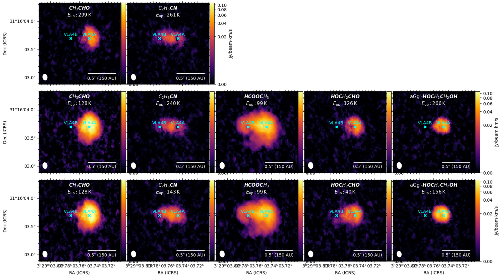
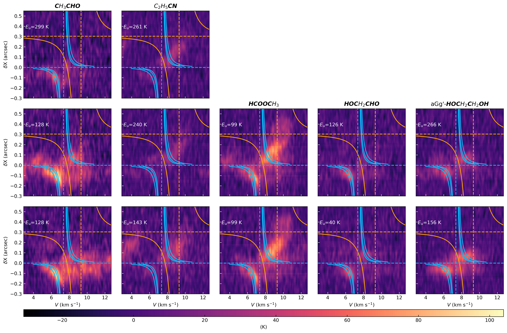

# SVS13A Astrochemical Analysis Pipeline

Python analysis pipeline for **ALMA spectral cube observations** of the Class I protobinary system **SVS13A**, developed to study the **spatial distribution, kinematics, and excitation conditions of complex organic molecules (COMs)**.

This repository contains the analysis tools used in the **2025 TARA Summer Research Project**, supervised by **Dr. Tien-Hao Hsieh**, with guidance from **Dr. Yu-Nung Su (ASIAA)** and **Prof. Shih-Ping Lai (NTHU)**.

Author  
Meng-Lun Wu  
Department of Chemistry  
National Taiwan University

---

# Scientific Motivation

Understanding the formation of planetary systems requires studying the chemical and dynamical evolution of young stellar objects. Observations of complex organic molecules (COMs) in protostellar environments provide key constraints on the physical conditions and chemical pathways during early star and planet formation.

The **Class I protostellar phase** is particularly important because

- the protostellar envelope is dispersing
- circumstellar disks are still forming
- active accretion continues

In binary systems, **streamers** may transport material from the envelope to the disks or connect the two protostars.

These dynamical processes may produce **chemical segregation**, where different molecules trace different physical environments.

Studying these effects helps reveal the **chemical history and physical structure of protostellar systems**.

---

# Target Source

**SVS13A**

Location  
NGC 1333 star-forming region

Distance  
≈ 300 pc

System properties

- Class I protobinary
- Components: **VLA4A** and **VLA4B**
- Separation ≈ 90 AU

SVS13A is known to be rich in **complex organic molecules (COMs)** and is therefore an excellent laboratory for astrochemical studies.

---

# Observational Data

Observatory  
**ALMA**

Band  
Band 6

Frequency coverage

218 – 233 GHz

Spectral windows

10 spectral windows containing transitions of multiple COM species.

At the distance of SVS13A

0.5 arcsec ≈ 150 AU

---

# Molecules Studied

O-bearing COMs

- Glycolaldehyde
- Methyl formate
- Acetaldehyde
- Ethylene glycol

N-bearing species

- Propanenitrile

These molecules are particularly useful because their **formation pathways differ**

- grain-surface chemistry
- gas-phase reactions

Thus they can probe **thermal history and chemical evolution**.

---

# Pipeline Overview

The pipeline performs several key analyses on ALMA spectral cubes.

## 1 Spectral Cube Analysis

From ALMA data cubes the pipeline generates

- **Moment 0 maps** (integrated intensity)
- **Moment 1 maps** (velocity field)

These maps reveal

- spatial distribution of molecular emission
- kinematic structures such as rotation or velocity gradients.

---

## 2 Position–Velocity (PV) Diagrams

PV diagrams are extracted along the axis connecting the two protostars.

These diagrams help visualize

- rotational signatures
- velocity gradients
- possible infall or outflow motions.

Keplerian reference curves are overlaid to compare observations with theoretical expectations.

---

## 3 Chemical Segregation Analysis

Moment maps reveal clear chemical differences between the two protostellar components.

Compact emission near **VLA4A**

- acetaldehyde
- ethylene glycol

More extended emission bridging toward **VLA4B**

- methyl formate
- propanenitrile

These spatial differences indicate **chemical segregation within the protobinary system**.

---

## 4 Joint Gaussian Spectral Fitting

To analyze spectral lines the pipeline performs **joint Gaussian fitting** across multiple transitions.

Key features

- multiple transitions share the same  
  - centroid velocity  
  - linewidth

This allows strong lines to constrain weaker ones.

Two models are tested

- single-component Gaussian
- two-component Gaussian

Model selection uses the **Akaike Information Criterion (AIC)**.

---

## 5 Temperature Diagnostics

Gas temperatures are estimated using two complementary methods.

### Rotation Diagram Method

For molecules with ≥3 transitions

ln(N_u / g_u) vs E_u

The slope provides the excitation temperature.

---

### Line Ratio Thermometry

For molecules with only two transitions

temperature is derived from **line intensity ratios**.

---

# Key Results

1. **Chemical segregation is clearly observed**

O-bearing and N-bearing species show different spatial distributions.

2. **Velocity fields reveal rotational structures**

Moment 1 maps show a velocity gradient across **VLA4A** consistent with rotation.

3. **Temperature structure**

Acetaldehyde  
T ≈ 190 – 300 K

Glycolaldehyde  
T ≈ 35 – 75 K

This indicates molecule-dependent excitation conditions.

4. **Multiple gas components**

Two-component Gaussian fits reveal

- hot inner gas
- cooler envelope material

coexisting along the same line of sight.

---

# Example Results

Below are example outputs produced by the analysis pipeline.

## Molecular emission maps (Moment 0)

Integrated intensity maps of selected complex organic molecules toward SVS13A.


---

## Velocity field (Moment 1)

Intensity-weighted velocity maps showing the kinematic structure of the emitting gas.



---

## Position–velocity diagrams

Example PV diagrams used to study the spatial and kinematic distribution of molecular emission.



---

# Quick Start

Example workflow

## Generate moment maps

```bash
python scripts/make_moment0_maps.py
python scripts/make_moment1_maps.py
```

## Generate PV diagrams

```bash
python scripts/make_pv_diagrams.py
```

## Perform spectral fitting

```bash
python scripts/fit_joint_gaussian_2g.py
```

## Run temperature diagnostics

```bash
python scripts/run_rotation_diagram.py
```

---

# Dependencies

Python 3.10+

Main libraries

- numpy
- scipy
- pandas
- astropy
- matplotlib
- emcee
- spectral-cube
- radio-beam
- regions

Install dependencies

```bash
pip install -r requirements.txt
```

---


# Repository Structure

```
SVS13A-astrochemistry-analysis/

scripts/
    make_moment0_maps.py
    make_moment1_maps.py
    make_pv_diagrams.py
    make_temperature_maps.py
    fit_joint_gaussian_1g.py
    fit_joint_gaussian_2g.py
    fit_multi_gaussian.py
    run_rotation_diagram.py
    run_dual_line_temperature.py
    pick_targets.py
    mark_moment_map_targets.py

data/
    molecular_line/

figures/
    moment0_COMs.png
    moment1_velocity.png
    pv_diagrams/

results/
    gaussian_fitting/
    rotational_diagram/
    temperature_diagnostics/
    pv_diagrams/
    line_ratio_temperature/

notebooks/
    exploratory analysis
```


---

# Future Work

Planned extensions include

- deriving absolute column densities
- optical-depth corrections
- abundance calculations
- comparison with astrochemical models

---

# Data Availability

The ALMA data used in this project were obtained from the ALMA Science Archive.

Because the calibrated data cubes are large (tens of GB), they are not included in this repository.  
This repository instead provides the analysis scripts and derived products necessary to reproduce the results.
---


# Acknowledgements

This work was conducted during the **2025 TARA Summer Research Program**.

Supervisors

- Dr. Tien-Hao Hsieh  
- Dr. Yu-Nung Su  
- Prof. Shih-Ping Lai